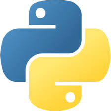
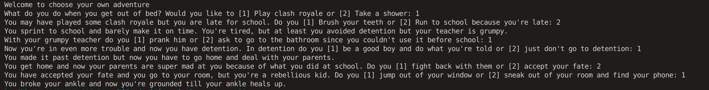
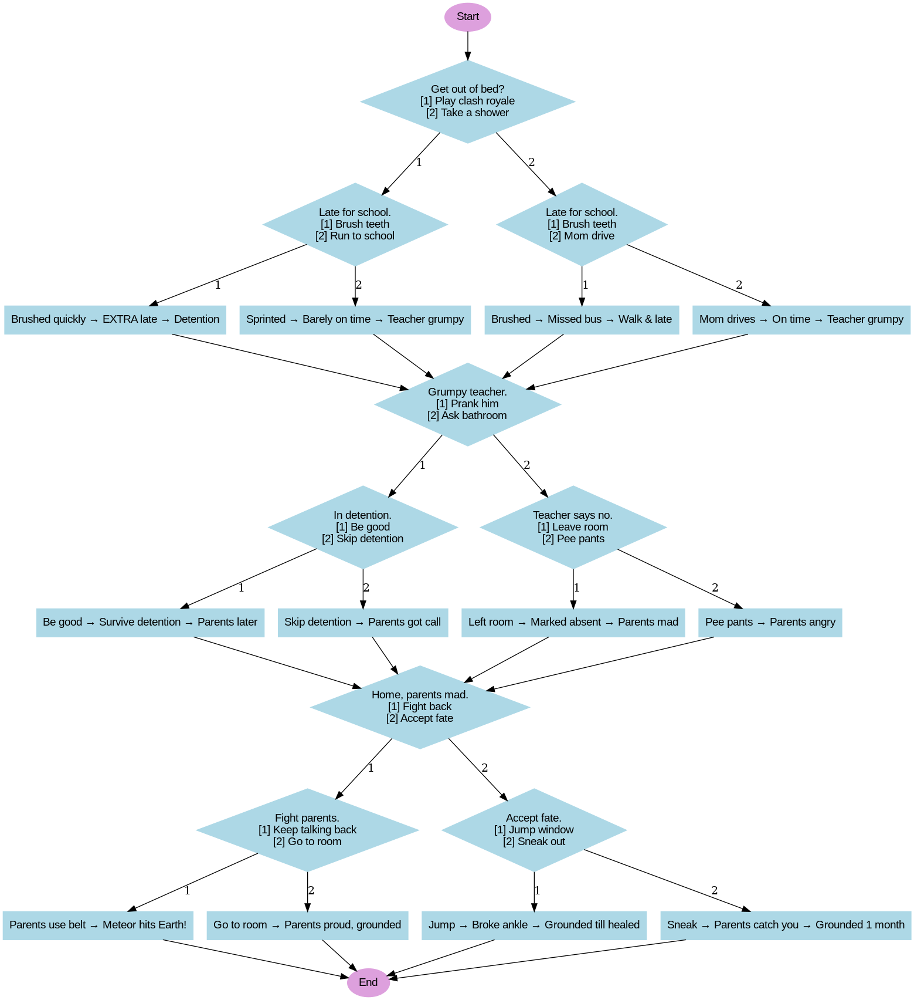

# Choose Your Own Adventure — Python (Simple CLI)

A tiny, playful **choose-your-own-adventure** command-line game written in plain Python.
You wake up, make choices, and discover different (sometimes messy) consequences — detention, grounded, or worse. Great for beginners * learning input, branching (if/elif/else) and small program flow.

## How to install
1. [Copy and paste the code and run it if you haven't found the code already](https://github.com/WTCSC/life-decision-simulator-ReeceL3.git)

# Features

* Plain Python (no external libraries required).

* Very small single-file game loop using input() and time.sleep() for pacing.

* Multiple branching endings depending on your choices.

* **Simple** and easy to extend.

# How to run

* Make sure you have **Python 3** installed (3.7+ recommended).

* Save the code to a file, e.g. adventure.py.

* Run from a terminal:

* Follow the prompts (enter 1, 2, or anything else) and hit Enter.

# Example playthrough

* Input 1 (play Clash Royale)

* Input 2 (run to school) → avoid detention but teacher is grumpy

* Input 1 (prank teacher) → detention

* Input 2 (skip detention) → go home, parents got a call

* Input 2 (accept fate at home) → choose 2 to sneak phone → grounded for a month

* (There are many other paths — try mixing options!)

I will also put a flow chart below the examples!

Here is another path you could possibly do^

# Ideas to improve / extend

* Validate inputs more robustly (loop until valid choice).

* Add functions to modularize each question / scene.

* Add randomized events or stats (energy, reputation).

* Save progress to a file so player can resume.

* Replace time.sleep() with more refined pacing or a user-controlled "continue".

* Add colorized terminal output using colorama (optional).

* Add unit tests for each branch (for learning/testing).

# Contributing

Feel free to fork & submit pull requests. Small, focused PRs are easiest to review:

Fix typos, grammar in the prompts.

Refactor into functions and add a main loop.

Add new branches and endings.

# 